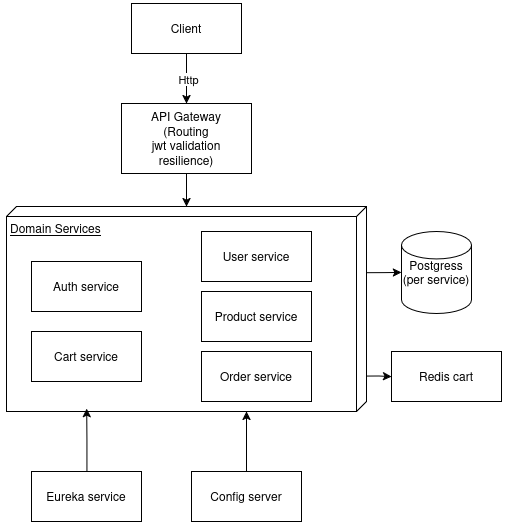

# Acme Shop (Java Backend) — Microservices Portfolio

A backend portfolio project built with **Java 17 + Spring Boot 3**, designed as a microservices e-commerce platform with **API Gateway**, **Service Discovery**, **Centralized Config**, **JWT + OAuth2 (Google)**, **Redis**, and **Resilience4J**.

> Goal: demonstrate production-style backend architecture, security, and service-to-service communication patterns.

---

## High-Level Architecture

<p align="center">
  
</p>

This diagram shows the main service boundaries and request flow through the API Gateway, plus internal service-to-service calls (Feign with JWT propagation) and core platform components (service discovery, centralized config, database-per-service, and Redis-backed cart.

For detailed sequence and deployment diagrams, see the documentation folder: [View detailed diagrams](./docs/diagrams)

---

## Architecture Overview

### Domain Services
- **Auth Service** – Authentication, OAuth2, JWT issuance
- **User Service** – Users, roles, permissions
- **Product Service** – Product catalog and stock
- **Cart Service** – Shopping cart with Redis
- **Order Service** – Order orchestration

### Platform Services
- **API Gateway** – Routing, security, resiliency
- **Eureka Server** – Service discovery
- **Config Server** – Centralized configuration

### Infrastructure
- **PostgreSQL** – Managed cloud database
- **Redis** – Cache and cart storage

---

## Shared Module

### acme-commons
A shared internal library used across services, providing:
- JWT utilities
- Security filters and interceptors
- Common enums and configuration

---

## Repository Structure

```bash
acme-shop/
├── acme-commons/
├── api-gateway/
├── auth-service/
├── user-service/
├── product-service/
├── cart-service/
├── order-service/
├── eureka-server/
├── config-server/
└── README.ms
